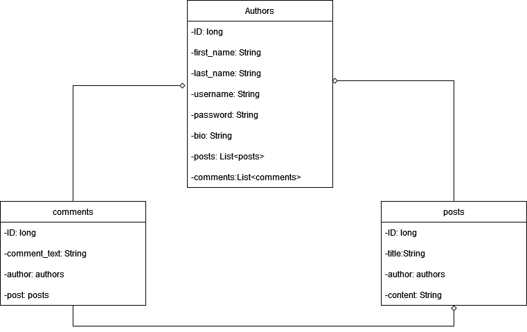
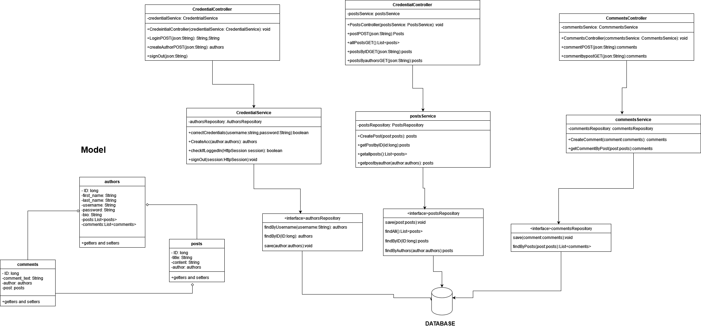

# Blogging_website

## Purpose of website

This website is a blogging poster where people can log in and create different blogs. The users are able to comment on eachothers blogs as well.

## How does it work?

### Database

Here you can see multiple one to many relationships where authors can have many posts and comments and posts can have many comments. The columns in the databases are pretty standard.

### UML design

Here you can see an uml design where there are three kinds of classes. There are repository classes which main purpose is to communicate with the database, There are service classes which handle the business logic of the rest api and finally there are the rest controllers who's main objective is to handle http requests. these classes all lead down to the database. 

### Frontend

The frontend is written in react and is fetching and posting data from the backend. The frontend consists of six pages. The index will open the sort of 'home' page where you can browse all the blogs, the login page lets you log in, the register page allows you to create a user, the profile page lets you see your own profile, the blog page lets you see a particular page and its comments, and finally the create blog page lets you create blogs.
